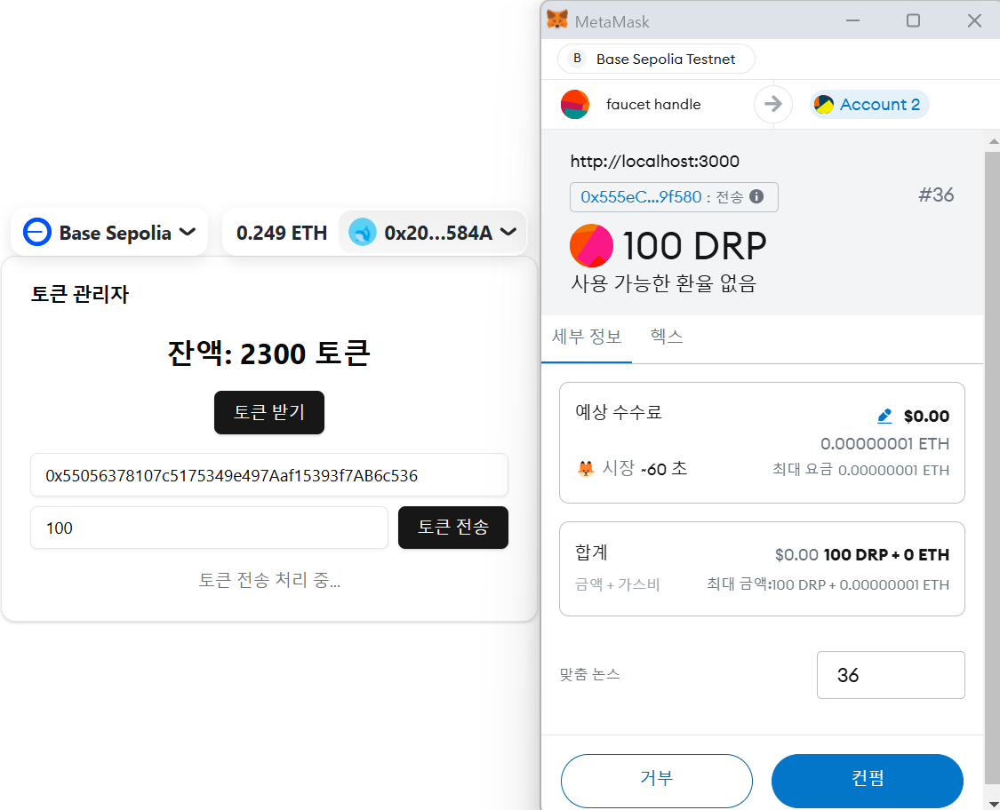
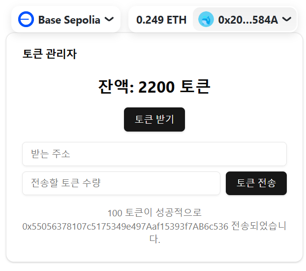
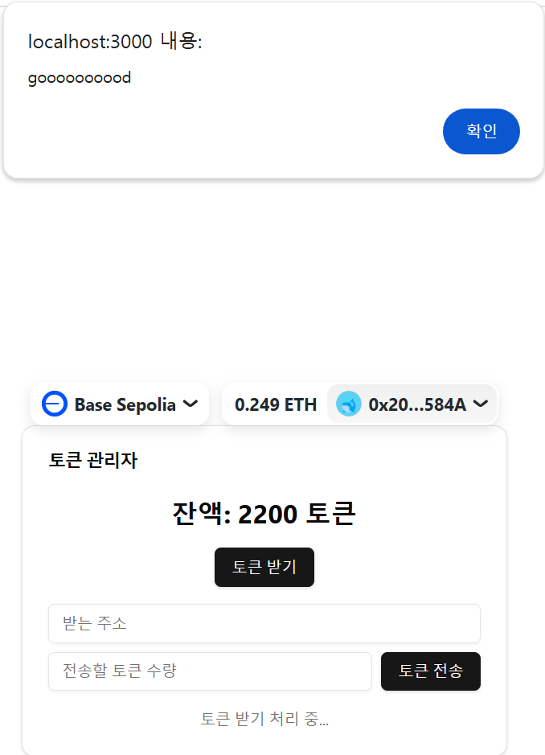
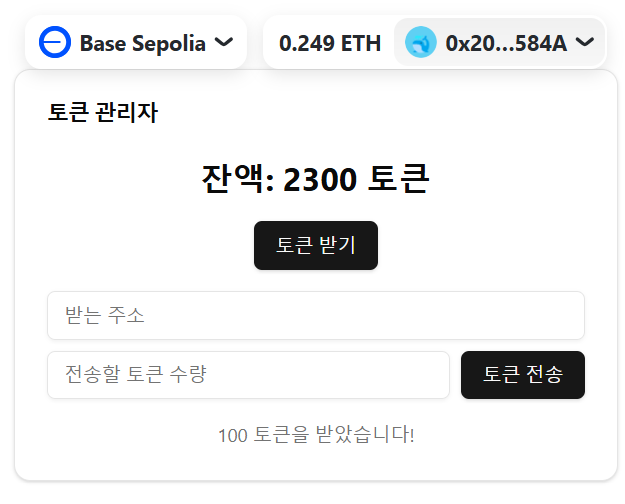

Hope to my token will be Jupiter token...

# * main 


# * sending token


# * token transfer completed


# * receiving token



# * token receipt completed




This is a [RainbowKit](https://rainbowkit.com) + [wagmi](https://wagmi.sh) + [Next.js](https://nextjs.org/) project bootstrapped with [`create-rainbowkit`](/packages/create-rainbowkit).

## Getting Started

First, run the development server: 

```bash
npm run dev
```

```dependencies
npm install
```

Open [http://localhost:3000](http://localhost:3000) with your browser to see the result.

You can start editing the page by modifying `pages/index.tsx`. The page auto-updates as you edit the file.

## Learn More

To learn more about this stack, take a look at the following resources:

- [RainbowKit Documentation](https://rainbowkit.com) - Learn how to customize your wallet connection flow.
- [wagmi Documentation](https://wagmi.sh) - Learn how to interact with Ethereum.
- [Next.js Documentation](https://nextjs.org/docs) - Learn how to build a Next.js application.

You can check out [the RainbowKit GitHub repository](https://github.com/rainbow-me/rainbowkit) - your feedback and contributions are welcome!

## Deploy on Vercel

The easiest way to deploy your Next.js app is to use the [Vercel Platform](https://vercel.com/new?utm_medium=default-template&filter=next.js&utm_source=create-next-app&utm_campaign=create-next-app-readme) from the creators of Next.js.

Check out the [Next.js deployment documentation](https://nextjs.org/docs/deployment) for more details.


## env setting

- BASE_SEPOLIA_RPC_URL= refer 'https://sepolia.base.org'
- ADMIN_PRIVATE_KEY= use your Metamask or Phatom wallet address's Private Key + Prefix as '0x'
- NEXT_PUBLIC_TOKEN_CONTRACT_NAME = refer contracts/Drop.sol, You can chahge that's name whatever you want
- NEXT_PUBLIC_TOKEN_CONTRACT_ADDRESS= use deployed contract address(write right code that your command console)
=> npx hardhat compile -> npx hardhat run scripts/token_deploy.js --network sepoliaBase(You can choose whatever you want) -> npx hardhat run scripts/token_distribute.js --network sepoliaBase  
- NEXT_PUBLIC_ADMIN_WALLET_ADDRESS= your wallet address


## test Ether get

- if you don't have any Base Sepolia network's Test ETH, search 'Base Sepolia Faucet' at Google. Then, you can get Base Sepolia network's Test ETH

## Backend Server

- enter right command at your terminal: npx nodemon .\src\server.js

